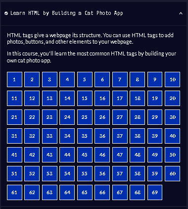
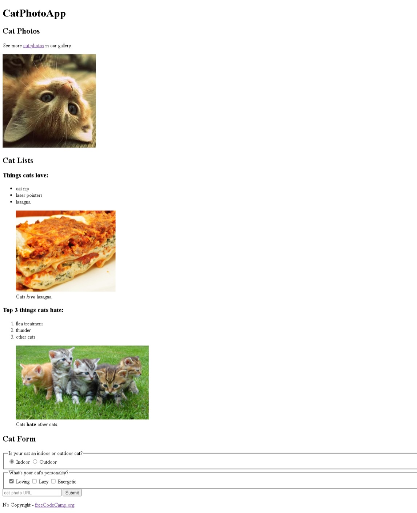

# 1-Learn_HTML_by_Building_a_Cat_Photo_App

### HTML tags give a webpage its structure. You can use HTML tags to add photos, buttons, and other elements to your webpage.

In this course, you'll learn the most common HTML tags by building your own cat photo app.

