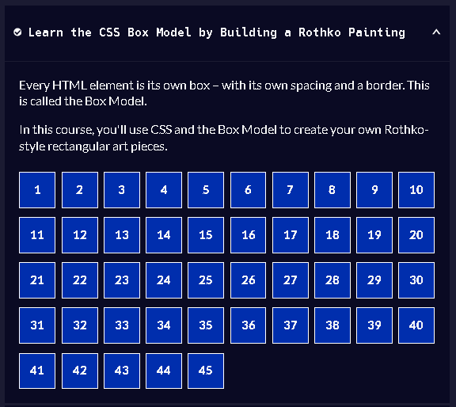
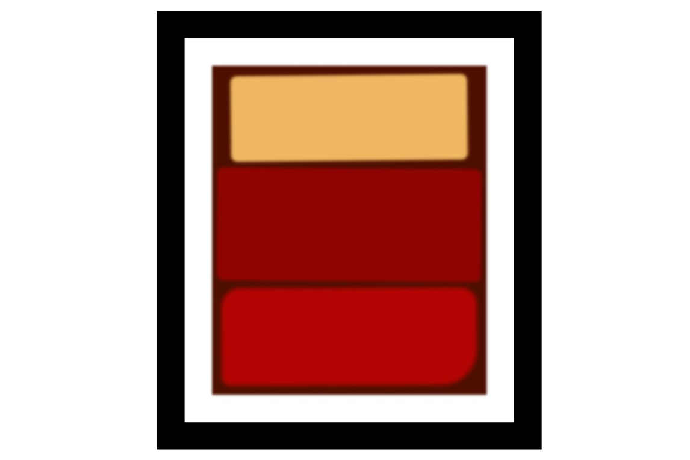

# 1-Learn_the_CSS_Box_Model_by_Building_a_Rothko_Painting

### Every HTML element is its own box – with its own spacing and a border. This is called the Box Model.

In this course, you'll use CSS and the Box Model to create your own Rothko-style rectangular art pieces.

