# Instalacion y desinstalacion de paquetes con NPM

1. Creamos un archivo package.json con el comando:
      ```console
    $ npm init --yes
    ```
    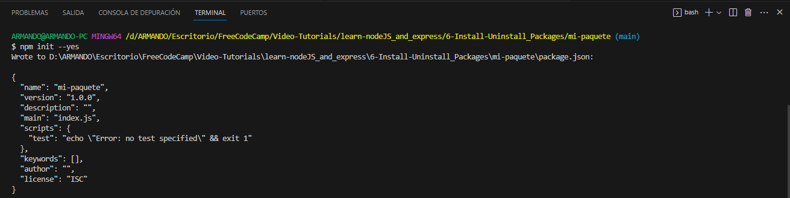

2. Veremos la creación del archivo package.json y su contenido, el cual editaremos algunas cositas:

    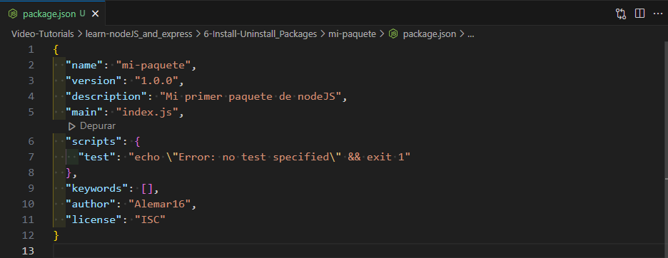

## Instalacion del Primer paquete

1. Ahora instalaremos nuestro primer paquete en este caso será Express, y nos dirigiremos a la pagina de [npm](https://www.npmjs.com), buscaremos en el buscador [Express](https://www.npmjs.com/package/express)

    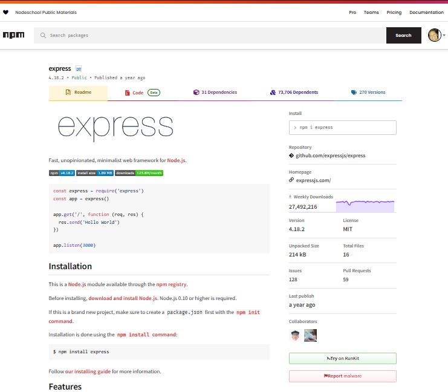

2. Usaremos el comando de instalacion para Express 
    ```console
    $ npm install express
    ```

    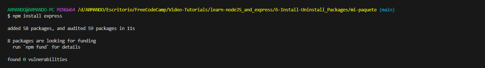
    Notaremos que se han instalado 58 packages entre otras cosas.

3. Verificamos que dentro de nuestro archivo package.json ahora se agregó Express:
    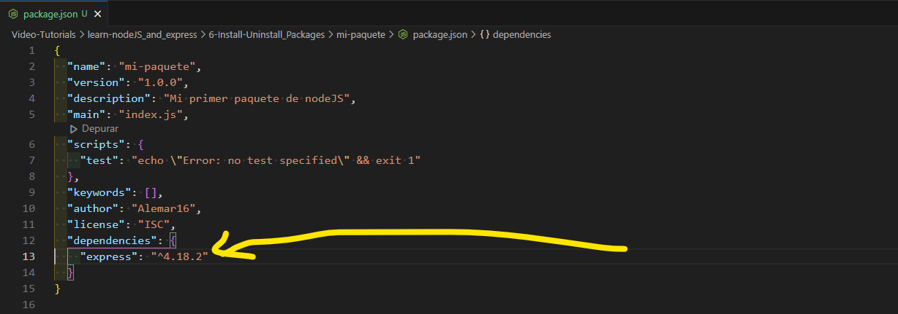

4. Tambien notaremos que se creo una carpeta "node_modules" que contendrá las dependencias en paquetes de express
    <div align="center">
    <figure>
        <figcaption>Imagen 1</figcaption>
        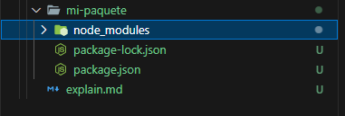
    </figure>
    <figure>
        <figcaption>Imagen 2</figcaption>
        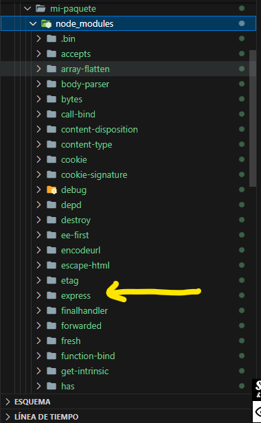
    </figure>
    <figure>
        <figcaption>Imagen 3</figcaption>
        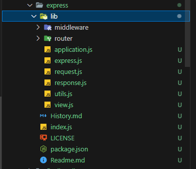
    </figure>
</div>

## Desinstalación del paquete 

1. Ahora para desinstalar un paquete usaremos el comando para Express:
     ```console
    $ npm uninstall express
    ```
    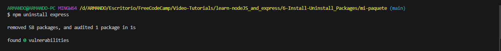

2. Notaremos que ahora en el archivo package.json no se encuentra las dependencias de Express:
    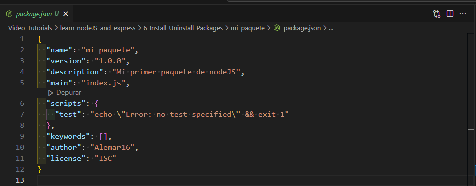


## Instalacion de paquetes segun su version

1. Es util para cuando queremos instalar algun paquete con una version especifica segun el uso que se necesita para el proyecto. en este caso usaremos la sintasis de:

     ```console
    $ npm install express@4.15.1
    ```
  De esta manera utilizando la sintasis de "@" segiuido de numero de version, se instalara ese paquete en el archivo package.json

## Importante tener en cuenta

1. cuando deseamos instalar un paquete que solo sea para desarrollo, es decir que no tendrá uso para el funcionamiento del programa, sino solo durante el desarrollo de la misma, se utiliza una sintasis como esta:

   ```console
    $ npm install express --save-dev
    ```

    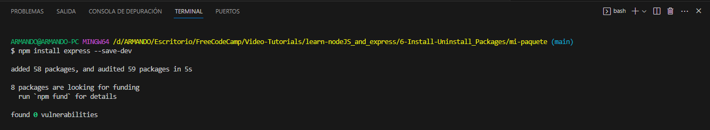
    De esta manera se instalará en el archivo package.json 

    Y de esta manera observaremos que la dependencia se instalo como "devDependencies" 
    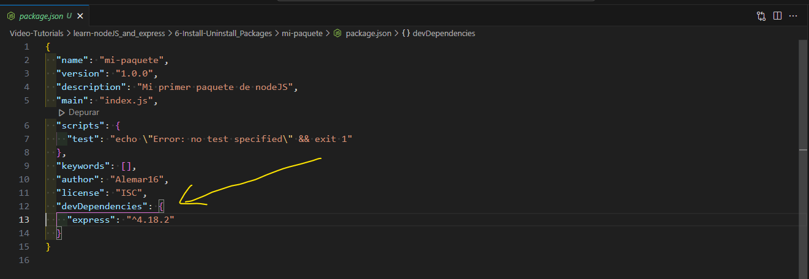
    

***

2. Generalmente cuando descargamos un repositorio de github, la carperta "node_modules" no se encuentra en el repositorio debido al gran tamaño que tiene por el contenido de datos de los paquetes. sin embargo para trabajar em dicho repositorio es necesario utilizar el comando:

  ```console
    $ npm install
   
para que se instale la carpeta "node_modules" y contenga todas las dependencias necesarias para comtinuar con el proyecto.
