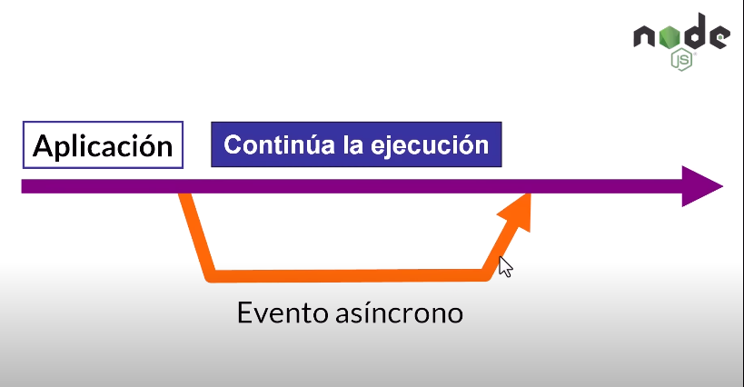
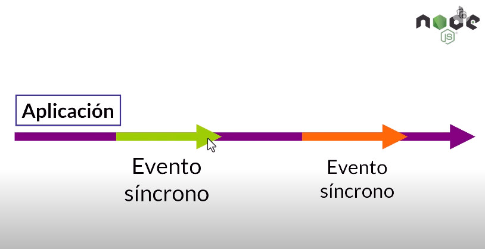
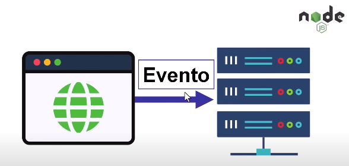
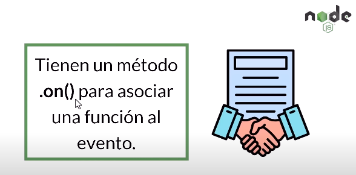
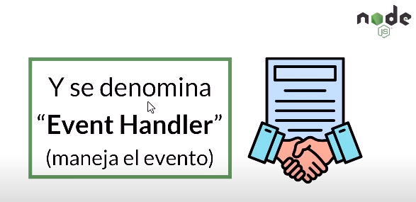
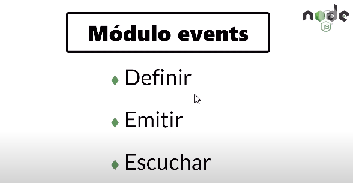

# Eventos en Node.js

## Asincronico y Sincronico ¿En que consiste?
    En programación, "asíncrono" se refiere a la ejecución de tareas de manera no bloqueante, lo que permite que un programa continúe funcionando mientras espera que ciertas operaciones se completen. 

  
  Cuando una aplicacion se esta ejecutando, si ocurre un evento asincrono, ese evento se ejecuta en paralelo con la ejecucion de la aplicacion sin bloquearla, es decir continua la ejecucion de ambos procesos

  
  En cambio, en evento sincrono bloquea la ejecucion de la aplicación hasta que no se complete todo el proceso que desencadenó ese evento, lo que al final podemos continuar

```
En Node.js, un entorno de tiempo de ejecución de JavaScript, la asincronía es fundamental para realizar tareas como llamadas a bases de datos o solicitudes a servidores sin detener la ejecución del programa.
```
***


## ¿Que es un Evento?
  ```
  Un "evento" es una accion que se realiza en la aplicación.
  por ejemplo:
              - Pedir una informacion a una base de datos
              - Agregar informacion a una base de datos.
              - entre otras.
  ```

```
Node.js está basado en eventos asincronos
```

"Un evento es una accion que desencadena un proceso"

***

## Emitters (emisores)

En node.js tenemos un módulo en especifico que nos permite definir nuestros propios eventos, ademas de trabajar con los que ya vienen predeterminados.

#### Emitters
    "Son Objetos que emiten eventos nombrados y llaman a funciones especificas cuando ocurren"

    Los Emisores son instancias de la clase "EventEmitter"


"Vamos a llamar a ese evento cuando queramos asociar que es lo que vá a ocurrir cuando ocurra un cierto evento"


Y tambien lo puedes encontrar como "EventListener" ya que se usan de forma similar debido a que manejan el evento.

