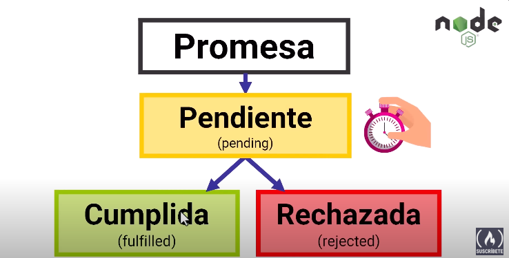
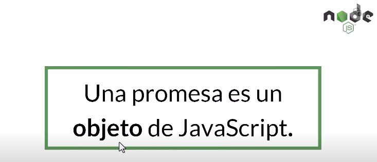
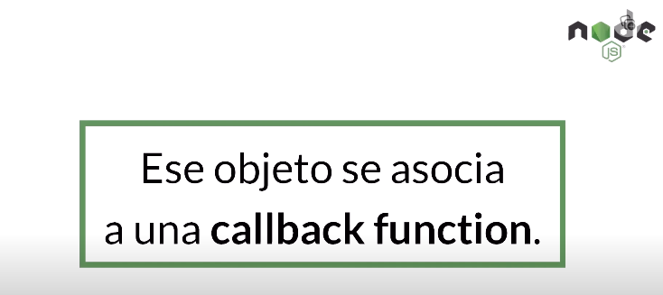
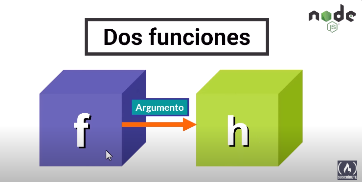
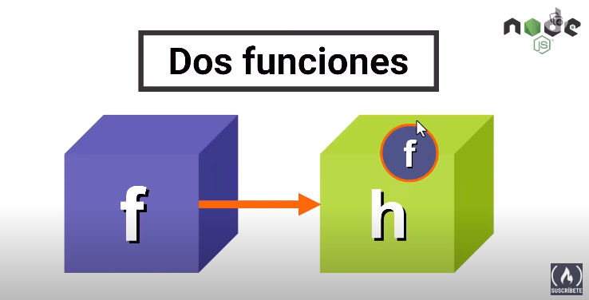
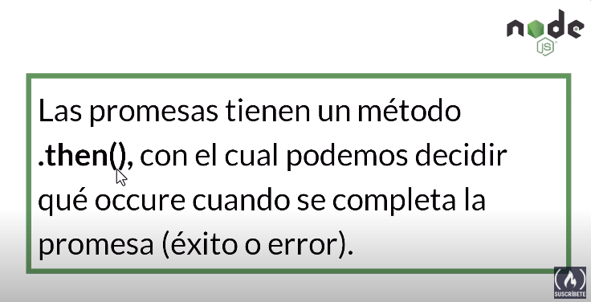

# Promesas en javaScript

## Promesa
  Es un objeto que representa el eventiul redultado (o error) de una operacion asíncrona.

  
  Cuando estamos interactuando con una aplicacion web y hacemos una solicitud al sevidor, normanmente vamos a trabajar con promesas, porque no sabemos cuanto tiempo le va a tomar al servidor retornar esa respuesta ytambienb todo depende de la conexion a internet y distintos factores que no podemos controlar, tambiern el servidor utiliza promesas que no sabe cuanto tiempo le va a tomar

  
  La promesa la creamos y cuando se usa, cuando se inicia ese proceso asincrono va estar en el estado pendiente (pending) porque no sabemos cuanto tiempo va a tomar.

  
  Luego transcurre el tiempo y en algun moomento cuando se culmine va estar en algunos de estos dos estados: Cuulplida (fulfilled) o Rechazada (rejected).

  
  Es importante resaltar que una promesa es un OBJETO de JavaScript

  
  Una funcion que se ejecuta cuando se completa el proceso asíncronico para procesar el resultado. (Callback function)
  
  
  La funnction callback es una funcion que se pasa a otra funcion como argumento y luego se ejecuta dentro de la funcion externa
   

  
***
## Resumen
#### Una promesa en Node.js es un objeto que se utiliza para manejar tareas asincrónicas de manera más organizada y legible. Esencialmente, una promesa representa un valor que puede estar disponible en el futuro, pero no necesariamente en el momento en que se crea la promesa. Esto es útil cuando se trabaja con operaciones asincrónicas como lecturas de archivos, solicitudes HTTP o consultas a bases de datos, donde el resultado puede demorar en llegar.

Las promesas en Node.js tienen tres estados principales:

Pendiente (pending): Cuando se crea una promesa, inicialmente se encuentra en este estado.
Resuelta (fulfilled): Cuando la operación asincrónica se completa exitosamente, la promesa pasa a este estado y proporciona un valor resultante.
Rechazada (rejected): Si la operación asincrónica falla, la promesa pasa a este estado y proporciona un motivo de error.
Puedes usar métodos como .then() para manejar el caso en que la promesa se resuelve exitosamente y .catch() para manejar errores si la promesa se rechaza. Esto permite un código más claro y estructurado al trabajar con tareas asincrónicas en Node.js.
