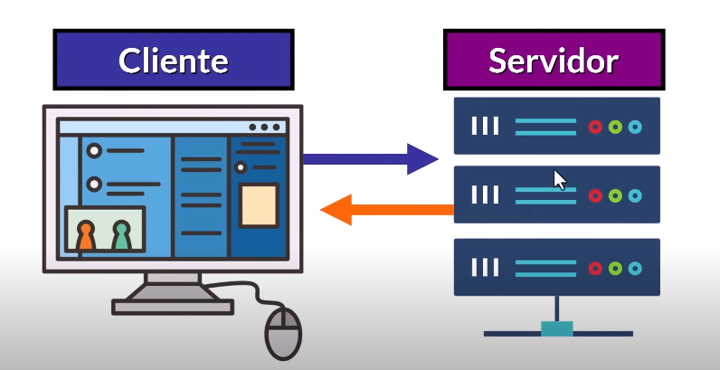
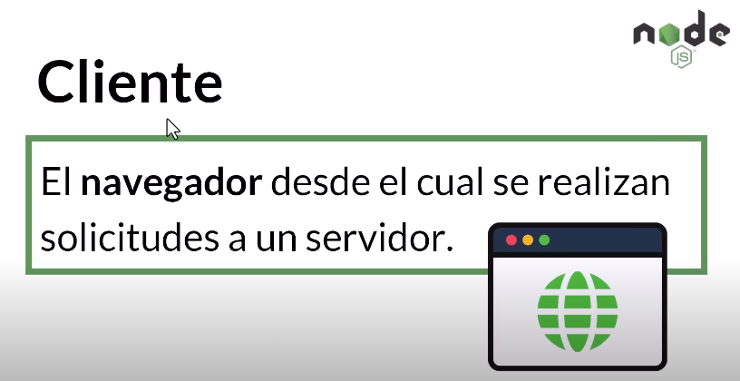
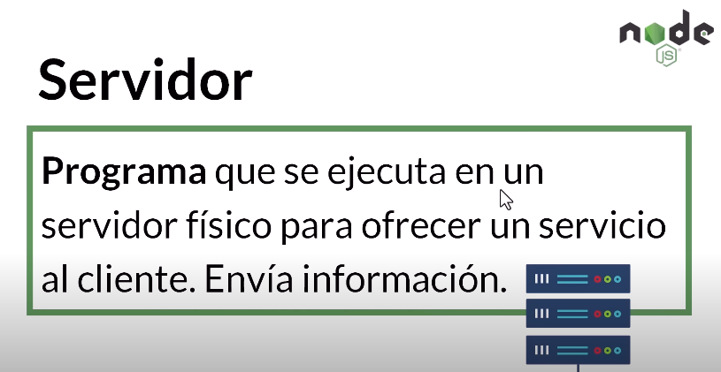
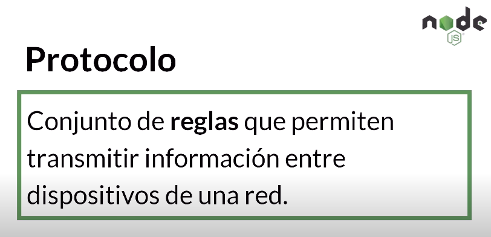

# Client-Server Model
  
#### Modelo que usamos para acceder a internet y obtener recursos e información.
      Este modelo es tan importante que sin el "no exixtiría Internet" 
***
## Cliente y Servidor

### Un cliente envia solicitudes a un resvidor y este ultimo responde

***
## ¿Como se definen?
    Cliente: En esta arquitectura, el cliente es la parte de la aplicación que solicita y consume los servicios proporcionados por el servidor. Puede ser una aplicación web, una aplicación móvil, un navegador web o cualquier dispositivo que se comunique con el servidor para obtener datos o ejecutar acciones.
    
    Servidor: El servidor es la parte central que proporciona los servicios y recursos solicitados por los clientes. En el contexto de Node.js, el servidor se crea utilizando el entorno de ejecución de Node.js para crear aplicaciones del lado del servidor. Puede manejar solicitudes HTTP, servir archivos, interactuar con bases de datos y realizar diversas tareas en respuesta a las solicitudes de los clientes.

***

## ¿Como se entienden?
Para que se puedan entender deben tener una comunicacion en un formato especifico

Este Modelo sabe como hacerlo porque conode el formato:

  
  

## El formato

  

### HTTP significa: 
    Protocolo de Transferencia de Hipertexto

    Comunicación: La comunicación entre el cliente y el servidor se realiza a través de solicitudes y respuestas. Por ejemplo, un cliente web (navegador) puede enviar una solicitud HTTP al servidor Node.js para obtener una página web o datos. El servidor procesa la solicitud y envía una respuesta al cliente.

## Resumen
    En resumen, el modelo cliente-servidor en Node.js se refiere a la arquitectura en la que Node.js actúa como servidor, proporcionando servicios y recursos a los clientes que solicitan información o realizan acciones a través de una comunicación basada en solicitudes y respuestas. Node.js es especialmente adecuado para construir servidores altamente eficientes y escalables que pueden atender a múltiples clientes de manera simultánea gracias a su naturaleza asincrónica.