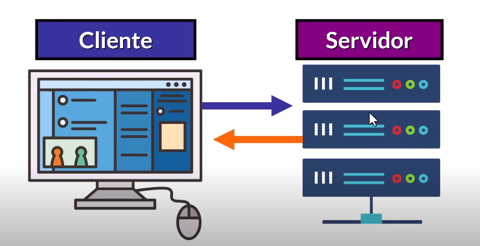
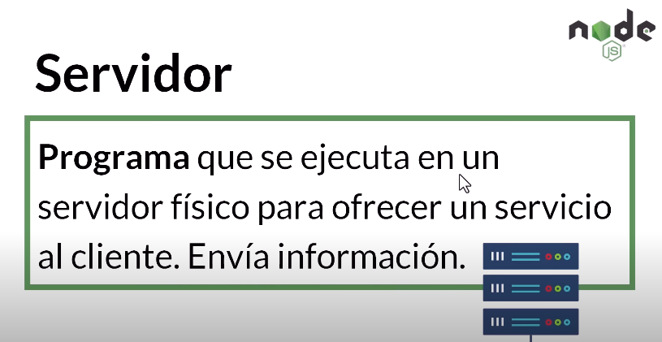
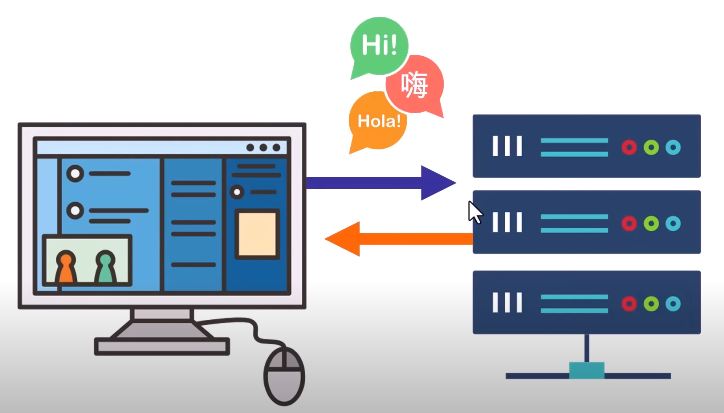
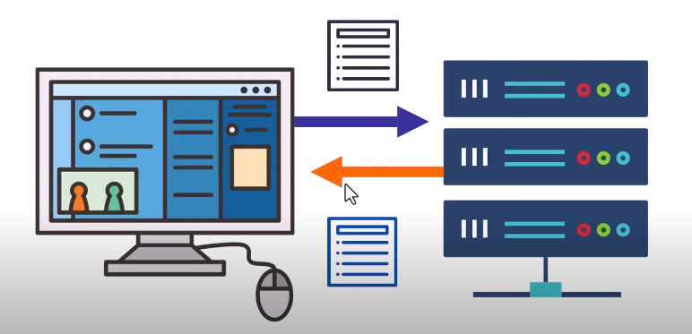
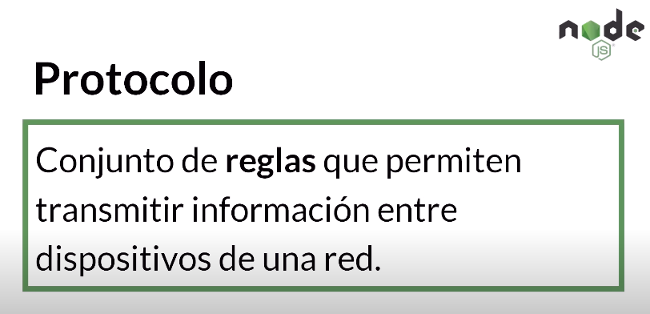

# Client-Server Model
  
#### Modelo que usamos para acceder a internet y obtener recursos e información.
      Este modelo es tan importante que sin el "no exixtiría Internet" 
***
## Cliente y Servidor

### Un cliente envia solicitudes a un resvidor y este ultimo responde
***
## ¿Como se definen?

***

## ¿Como se entienden?
Para que se puedan entender deben tener una comunicacion en un formato especifico

Este Modelo sabe como hacerlo porque conode el formato:

  
  

## El formato

  

### HTTP significa: 
    Protocolo de Transferencia de Hipertexto